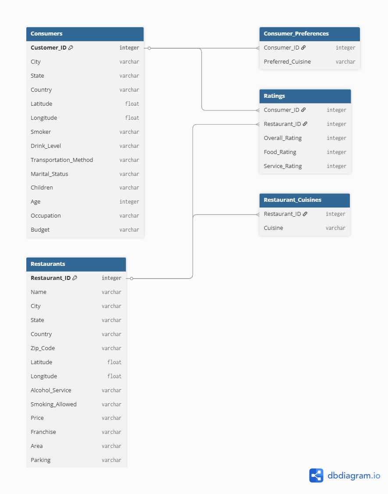

# Restaurant Ratings Analysis

## Table of Content
* [Case Study](#case-study)
* [Dataset Description](#dataset-description)
* [ER Diagram](#er-diagram)
* [Data Cleaning](#data-cleaning)
* [Data Analysis](#data-analysis)
* [Dashboard](#dashboard)

## Case Study
Restaurant ratings in Mexico by real consumers from 2012, including additional information about each restaurant and their cuisines, and each consumer and their preferences.

## Dataset Description
Our dataset consists of the following observations:

### Consumers
| Column | Description |
|--------|-------------|
| Consumer_ID | Unique identifier for each consumer |
| City | City where the consumer lives |
| State | State where the consumer lives |
| Country | Country where the consumer lives |
| Latitude | Latitude where the consumer lives |
| Longitude | Longitude where the consumer lives |
| Smoker | Whether the consumer smokes or not |
| Drink_Level | Whether the consumer is an abstemious, casual, or social drinker |
| Transportation_Method | Whether the consumer transports on foot, by public transport, or by car |
| Marital_Status | The consumer's marital status (single or married) |
| Children | Whether the consumer has dependent/independent children or kids |
| Age | The consumer's age |
| Occupation | The consumer's occupation (student, employed, or unemployed) |
| Budget | The consumer's budget (low, medium, high) |

### Consumer Preferences
| Column | Description |
|--------|-------------|
| Consumer_ID | Unique identifier for each consumer |
| Preferred_Cuisine | Types of food the consumer prefers |

### Ratings
| Column | Description |
|--------|-------------|
| Consumer_ID | Unique identifier for each consumer |
| Restaurant_ID | Unique identifier for each restaurant |
| Overall_Rating | The overall rating (0=Unsatisfactory, 1=Satisfactory, 2=Highly Satisfactory) |
| Food_Rating | The food's rating (0=Unsatisfactory, 1=Satisfactory, 2=Highly Satisfactory) |
| Service_Rating | The service rating (0=Unsatisfactory, 1=Satisfactory, 2=Highly Satisfactory) |

### Restaurants
| Column | Description |
|--------|-------------|
| Restaurant_ID | Unique identifier for each restaurant |
| Name | The restaurant's name |
| City | The restaurant's city |
| State | The restaurant's state |
| Country | The restaurant's country |
| Zip_Code | The restaurant's zip code |
| Latitude | The restaurant's latitude |
| Longitude | The restaurant's longitude |
| Alcohol_Service | Whether the restaurant serves no alcohol, wine & beer, or a full bar |
| Smoking_Allowed | Whether any smoking is allowed |
| Price | The restaurant's price (low, medium, high) |
| Franchise | Whether the restaurant is a franchise |
| Area | Whether the restaurant is in an open or closed area |
| Parking | Whether the restaurant offers parking (none, yes, public, valet) |

### Restaurant Cuisines
| Column | Description |
|--------|-------------|
| Restaurant_ID | Unique identifier for each restaurant |
| Cuisine | Types of food the restaurant serves |

## ER Diagram


## Data Cleaning

### Steps to Import Data as a Folder
1. Get Data -> More -> All -> Folder -> Connect -> Path leading to the folder dataset -> Click OK
2. Click on Transform Data -> Duplicate the file -> Click on Binary to expand the dataset (Repeat for each dataset)

### Calculated Fields

**Age Group**
```DAX
AgeGroup = 
SWITCH(
    TRUE(),
    consumers[Age] <= 18, "Children and Adolescents",
    consumers[Age] <= 30, "Young Adults",
    consumers[Age] <= 45, "Adults",
    consumers[Age] <= 60, "Middle-aged Adults",
    "Seniors"
)
```

**Service Rating Category**
```DAX
Service_Rating_Category = SWITCH(
    TRUE(),
    ratings[Service_Rating] = 0, "Unsatisfactory",
    ratings[Service_Rating] = 1, "Satisfactory",
    "Highly Satisfactory"
)
```

**Overall Rating Category**
```DAX
Overall_Rating_Category = SWITCH(
    TRUE(),
    ratings[Overall_Rating] = 0, "Unsatisfactory",
    ratings[Overall_Rating] = 1, "Satisfactory",
    "Highly Satisfactory"
)
```

**Food Rating Category**
```DAX
Food_Rating_Category = SWITCH(
    TRUE(),
    ratings[Food_Rating] = 0, "Unsatisfactory",
    ratings[Food_Rating] = 1, "Satisfactory",
    "Highly Satisfactory"
)
```

## Data Analysis

### 🏙️ Local Insights

**What is the distribution of consumers by city and state?**
Most of the population is from San Luis Potosí, San Luis Potosí, while the second largest group is from Cuernavaca, Morelos.

**How does the age distribution of consumers vary by state?**
In all three states, young adults under 30 years of age form the majority of the population. In two states, San Luis Potosí and Morelos, the second largest demographic consists of seniors, aged over 60 years.

**What percentage of consumers are smokers or non-smokers in each city?**
The vast majority of consumers from all four cities are non-smokers, with Jiutepec having a 100% non-smoking population. In Cuernavaca city, smokers make up 25% of the population.

**How common is parking availability at restaurants in different cities?**
The majority of restaurants across all cities lack parking facilities, while some have parking available. In San Luis Potosí and Cuernavaca, two restaurants offer valet parking, while public parking is available in San Luis Potosí, Ciudad Victoria, and Cuernavaca.

---

### 🍽️ Dining Insights

**How does the availability of parking correlate with restaurant price levels?**
Out of the 16 high-priced restaurants, 16 have parking available, with 3 offering valet parking, 1 providing public parking, and 5 lacking any parking options. Medium and low-priced restaurants do not offer valet parking; however, some provide public parking or have parking available, while others do not.

**What is the distribution of restaurants by state?**
San Luis Potosí has 84 restaurants, whereas Morelos and Tamaulipas each have 23 restaurants.

**How do restaurant franchises compare to non-franchises in terms of consumer ratings?**
The majority of the restaurants are non-franchises, equally distributed across three rating categories. A small portion are franchises, also equally distributed across the same three rating categories.

**What are consumers' preferred cuisines based on their demographic profiles?**
Mexican cuisine is the most preferred, followed by American cuisine.

---

### 🏨 Hospitality Insights

**How does the type of alcohol service offered vary by restaurants in each city?**
In the four cities combined, 66.92% of restaurants don't offer alcohol, 6.93% offer a full bar, and 26.15% offer wine and beer.

**What transportation methods are most commonly used by consumers?**
61% of consumers use public transportation, 27% use cars, and 11% walk.

**How does the presence of alcohol service influence consumer ratings?**
Among non-drinkers, 303 rated their experience as highly satisfactory, 289 as satisfactory, and 170 as unsatisfactory. For wine and beer consumers, ratings were 146 highly satisfactory, 105 satisfactory, and 68 unsatisfactory.

**What percentage of restaurants allow smoking in each state?**
Roughly 73% of restaurants maintain smoke-free policies, while only 1.5% in San Luis Potosí and Morelos allow smoking in bar sections. About 7% of restaurants permit smoking overall, with approximately 18.46% offering designated smoking areas.

---

### 🧍 Behavior Insights

**What are the common occupations of consumers in different states?**
In San Luis Potosí, 93% of the population consists of students. In Morelos, the population is almost equally split between employed individuals and students. In Tamaulipas, 94% of the population are students, while the remaining 6% are employed.

**How does the drink level vary across different states?**
In San Luis Potosí, almost 40% are social drinkers, 36% are casual drinkers, and 23% are abstemious. In Morelos, 45% are abstemious, 41% are casual drinkers, and 12% are social drinkers. In Tamaulipas, 52% are abstemious, 31% are casual drinkers, and 15% are social drinkers.

**How does marital status correlate with smoking or drinking habits?**
Among 88 single consumers, all are non-smokers. Among married non-smokers, 2 are abstemious and 5 are social drinkers. Additionally, 23 single consumers smoke and are social or casual drinkers. Lastly, 2 married smokers are also social drinkers.

**Is there a relationship between consumers' occupations and their budget levels?**
Among students, 67 have a medium budget, 33 have a low budget, and 4 have a high budget. Additionally, 15 employed individuals and 1 unemployed individual have a medium budget.

---

### ⭐ Review Insights

**What are the top 5 restaurants by food rating?**
The top 5 restaurants are Tortas Locas Hipocampo, Puesto de Tacos, Cafeteria y Restaurante El Pacífico (9 highly satisfactory), Gorditas Doña Gloria (10 highly satisfactory), and La Cantina Restaurante (11 highly satisfactory).

**What are the top 5 restaurants by service rating?**
The top 5 restaurants are Tortas Locas Hipocampo, Puesto de Tacos (12 satisfied), Cafeteria y Restaurante El Pacífico (12 satisfactory), Gorditas Doña Gloria (12 satisfactory), and La Cantina Restaurante (7 satisfactory).

**What are the top 5 restaurants by overall rating?**
The top 5 restaurants are Tortas Locas Hipocampo, Puesto de Tacos (30 highly satisfied), Cafeteria y Restaurante El Pacífico (24 highly satisfactory), La Cantina Restaurante (28 highly satisfied), and Restaurant la Chalita (20 highly satisfied).

## Dashboard
_(Add your Power BI dashboard screenshot here)_
